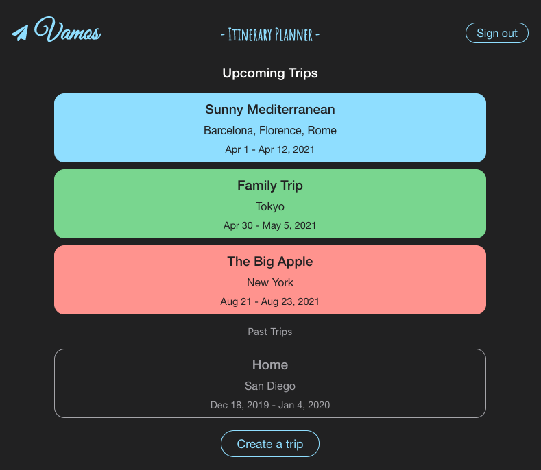
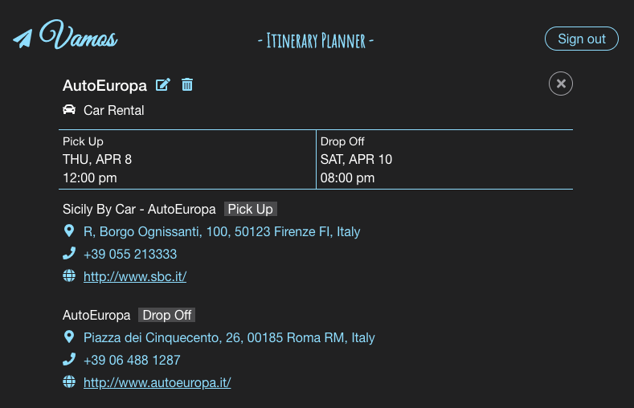

# Vamos - Itinerary Planner Server

Vamos is a full stack web application for managing travel itineraries. Users can create travel plans easily with autocomplete search for places and automatically fetched google places data.

This is the server-side code for the application with Express and PostgreSQL.

## Client

- [Client Repo](https://github.com/asching7108/itinerary-planner-app/)

## Set Up

- Clone this repository to your local machine: `git clone REPO-URL NEW-PROJECTS-NAME`
- cd into the cloned repository
- Make a fresh start of the git history for this project: `rm -rf .git && git init`
- Install dependencies: `npm install`
- Create development and test databases: `createdb vamos`, `createdb vamos_test`
- Create database user: `createuser vamos`
- Grant privileges to new user in `psql`:
  - `GRANT ALL PRIVILEGES ON DATABASE vamos TO vamos`
  - `GRANT ALL PRIVILEGES ON DATABASE "vamos-test" TO vamos`
- Prepare environment file: `cp example.env .env`
- Replace values in `.env` with your custom values
- Replace default values in `src/config.js` with your custom values
- Bootstrap development database: `npm run migrate`
- Bootstrap test database: `npm run migrate:test`

### Configuring Postgres

For tests involving time to run properly, your Postgres database must be configured to run in the UTC timezone.

1. Locate the `postgresql.conf` file for your Postgres installation.
    - OS X, Homebrew: `/usr/local/var/postgres/postgresql.conf`
2. Uncomment the `timezone` line and set it to `UTC` as follows:

```
# - Locale and Formatting -

datestyle = 'iso, mdy'
#intervalstyle = 'postgres'
timezone = 'UTC'
#timezone_abbreviations = 'Default'     # Select the set of available time zone
```

## Sample Data

- To seed the database for development: `psql -U vamos -d vamos -a -f seeds/seed.trip_tables.sql`
- To clear seed data: `psql -U vamos -d vamos -a -f seeds/trunc.trip_tables.sql`

## Scripts

- Start application `npm start`
- Start application for development: `npm run dev`
- Run tests: `npm test`

## Deploy

When ready for deployment, add a new Heroku application with `heroku create`. This will make a new git remote called "heroku" and you can then `npm run deploy` which will push to this remote's master branch.

## Features

* Authentication with JWT
* CRUD for trips (multiple destinations supported)
* CRUD for plans for trip (different types of plans supported)

## API Overview
```text
/api
.
├── /auth
│   └── POST
│       ├── /login
│       ├── /refresh
├── /users
│   └── POST
│       ├── /
├── /trips
│   └── GET
│       ├── /
│       ├── /:trip_id
│       ├── /:trip_id/plans
│       ├── /:trip_id/plans/plan_id
│   └── POST
│       ├── /
│       ├── /:trip_id/plans
│   └── DELETE
│       ├── /:trip_id
│       ├── /:trip_id/plans/plan_id
│   └── PATCH
│       ├── /:trip_id
│       ├── /:trip_id/plans/plan_id
```

### POST `/api/auth/login`
```js
// req.body
{
  email: String,
  password: String
}

// res.body
{
  authToken: String
}
```

### POST `/api/auth/refresh`
```js
// req.header
{
  Authorization: Bearer ${token}
}

// res.body
{
  authToken: String
}
```

### POST `/api/users`
```js
// req.body
{
  email: String,
  password: String,
  user_name: String
}

// res.body
{
  email: String,
  user_name: String
}
```

### GET `/api/trips`
```js
// req.header
{
  Authorization: Bearer ${token}
}

// res.body
{
  [
    id: tripId,
    trip_name: String,
    start_date: timestamp,
    end_date: timestamp,
    description: String,
    user_id,
    dest_cities: [
      id: destCityId,
      city_name: String,
      city_place_id: String,
      utc_offset_minutes: Integer,
      trip_id,
      viewport: {
        ne_lat: Float,
        ne_lng: Float,
        sw_lat: Float,
        sw_lng: Float
      }
    ]
  ]
}
```

### GET `/api/trips/:trip_id`
```js
// req.header
{
  Authorization: Bearer ${token}
}

// res.body
{
  id: tripId,
  trip_name: String,
  start_date: timestamp,
  end_date: timestamp,
  description: String,
  user_id,
  dest_cities: [
    id: destCityId,
    city_name: String,
    city_place_id: String,
    utc_offset_minutes: Integer,
    trip_id,
    viewport: {
      ne_lat: Float,
      ne_lng: Float,
      sw_lat: Float,
      sw_lng: Float
    }
  ]
}
```

### POST `/api/trips`
### PATCH `/api/trips/:trip_id`
```js
// req.header
{
  Authorization: Bearer ${token}
}

// req.body
{
  trip_name: String,
  start_date: timestamp,
  end_date: timestamp,
  description: String,
  dest_cities: [
    city_name: String,
    city_place_id: String,
    utc_offset_minutes: Integer,
    viewport: {
      ne_lat: Float,
      ne_lng: Float,
      sw_lat: Float,
      sw_lng: Float
    }
  ]
}

// res.body
{
  id: tripId,
  trip_name: String,
  start_date: timestamp,
  end_date: timestamp,
  description: String,
  user_id,
  dest_cities: [
    id: destCityId,
    city_name: String,
    city_place_id: String,
    utc_offset_minutes: Integer,
    trip_id,
    viewport: {
      ne_lat: Float,
      ne_lng: Float,
      sw_lat: Float,
      sw_lng: Float
    }
  ]
}
```

### GET `/api/trips/:trip_id/plans`
```js
// req.header
{
  Authorization: Bearer ${token}
}

// res.body
{
  [
    id: planId,
    plan_type: String,
    plan_name: String,
    start_date: timestamp,
    end_date: timestamp,
    description: String,
    plan_place_id: String,
    city_name: String,
    utc_offset_minutes: Integer,
    formatted_address: String,
    international_phone_number: String,
    website: String,
    plan_details: [
      id: planDetailId,
      plan_subtype: String,
      from_name: String,
      from_place_id: String,
      from_utc_offset_minutes: Integer,
      from_formatted_address: String,
      from_international_phone_number: String,
      from_website: String,
      from_terminal: String,
      from_gate: String,
      to_name: String,
      to_place_id: String,
      to_utc_offset_minutes: Integer,
      to_formatted_address: String,
      to_international_phone_number: String,
      to_website: String,
      to_terminal: String,
      to_gate: String,
      plan_id
    ]
  ]
}
```

### GET `/api/trips/:trip_id/plans/:plan_id`
```js
// req.header
{
  Authorization: Bearer ${token}
}

// res.body
{
  id: planId,
  plan_type: String,
  plan_name: String,
  start_date: timestamp,
  end_date: timestamp,
  description: String,
  plan_place_id: String,
  city_name: String,
  utc_offset_minutes: Integer,
  formatted_address: String,
  international_phone_number: String,
  website: String,
  plan_details: [
    id: planDetailId,
    plan_subtype: String,
    from_name: String,
    from_place_id: String,
    from_utc_offset_minutes: Integer,
    from_formatted_address: String,
    from_international_phone_number: String,
    from_website: String,
    from_terminal: String,
    from_gate: String,
    to_name: String,
    to_place_id: String,
    to_utc_offset_minutes: Integer,
    to_formatted_address: String,
    to_international_phone_number: String,
    to_website: String,
    to_terminal: String,
    to_gate: String,
    plan_id
  ]
}
```

### POST `/api/trips/:trip_id/plans`
### PATCH `/api/trips/:trip_id/plans/:plan_id`
```js
// req.header
{
  Authorization: Bearer ${token}
}

// req.body
{
  plan_type: String,
  plan_name: String,
  start_date: timestamp,
  end_date: timestamp,
  description: String,
  plan_place_id: String,
  city_name: String,
  utc_offset_minutes: Integer,
  formatted_address: String,
  international_phone_number: String,
  website: String,
  plan_details: [
    plan_subtype: String,
    from_name: String,
    from_place_id: String,
    from_utc_offset_minutes: Integer,
    from_formatted_address: String,
    from_international_phone_number: String,
    from_website: String,
    from_terminal: String,
    from_gate: String,
    to_name: String,
    to_place_id: String,
    to_utc_offset_minutes: Integer,
    to_formatted_address: String,
    to_international_phone_number: String,
    to_website: String,
    to_terminal: String,
    to_gate: String
  ]
}

// res.body
{
  id: planId,
  plan_type: String,
  plan_name: String,
  start_date: timestamp,
  end_date: timestamp,
  description: String,
  plan_place_id: String,
  city_name: String,
  utc_offset_minutes: Integer,
  formatted_address: String,
  international_phone_number: String,
  website: String,
  plan_details: [
    id: planDetailId,
    plan_subtype: String,
    from_name: String,
    from_place_id: String,
    from_utc_offset_minutes: Integer,
    from_formatted_address: String,
    from_international_phone_number: String,
    from_website: String,
    from_terminal: String,
    from_gate: String,
    to_name: String,
    to_place_id: String,
    to_utc_offset_minutes: Integer,
    to_formatted_address: String,
    to_international_phone_number: String,
    to_website: String,
    to_terminal: String,
    to_gate: String,
    plan_id
  ]
}
```

### DELETE `/api/trips/:trip_id`
### DELETE `/api/trips/:trip_id/plans/:plan_id`
```js
// req.header
{
  Authorization: Bearer ${token}
}

// res.body
{
  status: 204
}
```

## Sample Client Screenshots

Homepage / My Trips:



Trip Itinerary: 


Plan Details:



## Technologies

* Node.js
* Express
* PostgreSQL
* JavaScript
* JWT
* Chai & Mocha